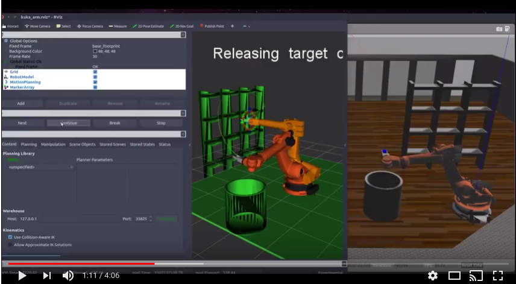

# Kuka KR210 Pick & Place Kinematics

A forward and inverse kinematics implementation using ROS and Python to control the joint angles of the Kuka KR210 six degree of freedom robotic arm used in the Udacity Pick and Place project. 

A video of the 6DOF arm in action can be seen below.

[](https://youtu.be/r3gGQV-yjX0)


## Project website

This repository has an accompanying project page, contains the theory and details behind the code. It can be found [here](https://www.haidynmcleod.com/robot-arm-kinematics).

#### External repositories

This repository contains the Forward and inverse kinematics implementation of the Udacity [Robot Arm - Pick & Place](https://github.com/udacity/RoboND-Kinematics-Project) project.

## Installation and Setup

1. This project requires the installation of ROS. Installation instructions can be found [here](http://wiki.ros.org/ROS/Installation).

2. Install the required python 2 packages.
* sympy
```
pip install sympy --user
```
* numpy
```
pip install numpy --user
```
* yaml
```
pip install pyyaml --user
```

3. Download and setup the [Udacity Projects repository](https://github.com/udacity/RoboND-Kinematics-Project). If ROS is installed, follow the setup instructions outlined in the repository.

4. Download or clone this repository.
```
git clone https://github.com/Heych88/udacity-RoboND-Kinematics.git
```

5. Navigate into where this repository was downloaded or cloned and copy `IK_server.py` to the Udacity Projects repository folder *RoboND-Kinematics-Project/kuka_arm/scripts*. If the steps followed in [Udacity Projects repository](https://github.com/udacity/RoboND-Kinematics-Project), the installation would be in *~/catkin_ws/*.
```
cp IK_server.py ~/catkin_ws/src/RoboND-Kinematics-Project/kuka_arm
/scripts
```

6. Navigate to where the [Udacity Projects repository](https://github.com/udacity/RoboND-Kinematics-Project) is located and change the permissions of the `IK_server.py` by
```
cd ~/catkin_ws/src/RoboND-Kinematics-Project/kuka_arm/scripts
sudo chmod +x IK_server.py
```

7. Build the project:
```sh
$ cd ~/catkin_ws
$ catkin_make
```

8. Add following to your .bashrc file
```
export GAZEBO_MODEL_PATH=~/catkin_ws/src/RoboND-Kinematics-Project/kuka_arm/models
source ~/catkin_ws/devel/setup.bash
```


## Running the code

When the [Udacity Projects repository](https://github.com/udacity/RoboND-Kinematics-Project) is first setup, it is setup for demo mode. To run `IK_server.py`, the **demo** flag must be set to _"false"_ in `inverse_kinematics.launch`. To change the flag navigate to */RoboND-Kinematics-Project/kuka_arm/launch* edit `inverse_kinematics.launch` and set the **demo** flag to _"false"_.
```
nano ~/catkin_ws/src/RoboND-Kinematics-Project/kuka_arm/launch/inverse_kinematics.launch
```

If everything has been setup correctly, you can launch the project by
```sh
$ cd ~/catkin_ws/src/RoboND-Kinematics-Project/kuka_arm/scripts
$ ./safe_spawner.sh
```

In a second terminal, run the `IK_server.py` by
```sh
$ cd ~/catkin_ws/src/RoboND-Kinematics-Project/kuka_arm/scripts
$ rosrun kuka_arm IK_server.py
```

